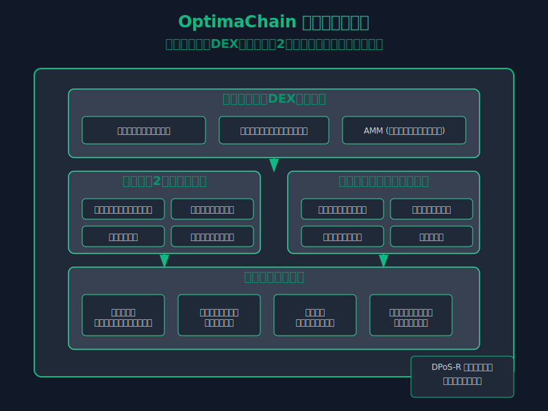
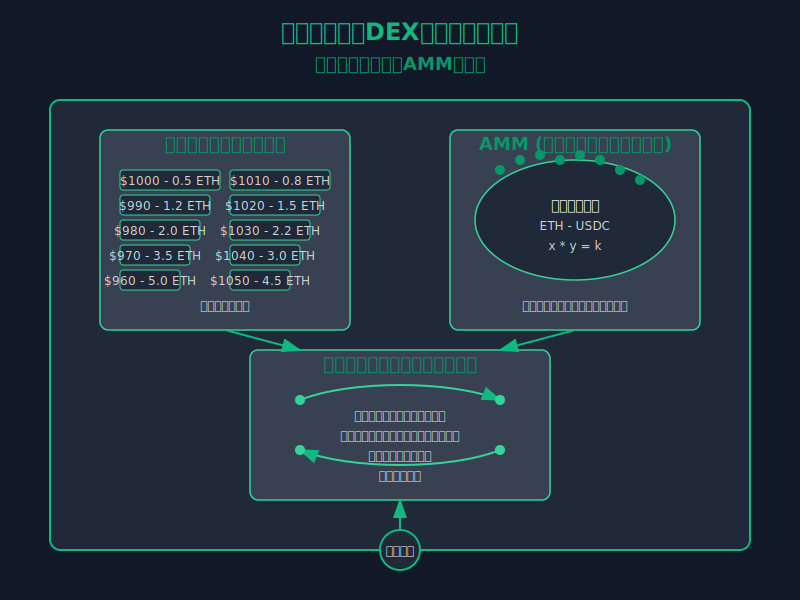

# OptimaChain - 高性能DEXプラットフォーム

[](https://github.com/enablerdao/OptimaChain/stargazers)
[](https://github.com/enablerdao/OptimaChain/network/members)
[](https://github.com/enablerdao/OptimaChain/issues)
[](https://github.com/enablerdao/OptimaChain/blob/main/LICENSE)
[](https://app.netlify.com/sites/optimachain/deploys)

> **開発進捗状況**: プロトタイプ段階 | DEX機能開発中 | 40ファイル | 最終更新: 2025年3月
>
> OptimaChainはプロトタイプ段階にあり、ハイブリッドDEXの基本機能とレイヤー2スケーリングソリューションの開発が進行中です。テストネットでの初期テストが開始されており、パフォーマンスとセキュリティの最適化が行われています。

<p align="center">
  
</p>

```
  ___        _   _                 ____ _           _
 / _ \ _ __ | |_(_)_ __ ___   __ _/ ___| |__   __ _(_)_ __
| | | | '_ \| __| | '_ ` _ \ / _` | |   | '_ \ / _` | | '_ \
| |_| | |_) | |_| | | | | | | (_| | |___| | | | (_| | | | | |
 \___/| .__/ \__|_|_| |_| |_|\__,_|\____|_| |_|\__,_|_|_| |_|
      |_|
```

OptimaChainは、革新的なスケーリング技術と高度なセキュリティを統合した分散型ブロックチェーンプラットフォームです。ハイブリッドDEX、レイヤー2スケーリング、マルチレベルセキュリティを提供し、高速で低コストの取引環境を実現します。

## 主な特徴

### ハイブリッドDEXアーキテクチャ

<p align="center">
  
</p>

- **AMM + 注文書ベースの取引**: 自動マーケットメーカーと注文書ベースの取引を組み合わせたハイブリッドモデル
  - **AMM**: 小額取引に最適な流動性を提供
  - **注文書**: 大口取引のスリッページを最小化
  - **スマートルーティング**: 最適な取引経路を自動的に選択

- **流動性集約アルゴリズム**: 複数の流動性プールを効率的に活用
  - **クロスプール最適化**: 複数のプールにまたがる取引を最適化
  - **動的手数料調整**: 市場状況に応じて手数料を自動調整
  - **流動性インセンティブ**: 流動性提供者への魅力的な報酬メカニズム

- **高度な取引機能**:
  - **条件付き注文**: リミット、ストップ、トレーリングストップなど
  - **時間加重平均価格(TWAP)**: 大口取引の市場への影響を最小化
  - **フラッシュスワップ**: 担保なしの一時的な流動性アクセス

### レイヤー2スケーリングソリューション

- **Optimistic Rollups**: メインチェーンの負荷を軽減しながら高スループットを実現
  - **バッチ処理**: 複数のトランザクションを一括処理
  - **データ圧縮**: オンチェーンデータを最小化
  - **詐欺証明**: 不正行為を検出するセキュリティメカニズム

- **ステートチャネル**: 頻繁な小額取引に最適化
  - **オフチェーン処理**: メインチェーンの負荷を軽減
  - **即時ファイナリティ**: 取引の即時確定
  - **低手数料**: マイクロトランザクションの実現

- **クロスレイヤー相互運用性**: レイヤー1とレイヤー2間のシームレスな資産移動
  - **高速ブリッジ**: レイヤー間の迅速な資産移動
  - **統合ウォレット**: 複数レイヤーを単一インターフェースで管理
  - **クロスレイヤー流動性**: レイヤー間で流動性を共有

### マルチレベルセキュリティ

- **DPoS-R (Delegated Proof of Stake with Reputation)**: 評判システムを組み込んだ委任型PoS
  - **バリデータ評価**: 過去のパフォーマンスに基づく評価システム
  - **動的委任**: 評判に基づく委任配分の最適化
  - **スラッシング条件**: 悪意ある行動に対する厳格なペナルティ

- **多層防御システム**:
  - **リアルタイム監視**: 異常なパターンの継続的な監視
  - **自動緊急停止**: 重大な脅威を検出した場合の自動保護メカニズム
  - **段階的セキュリティ**: 取引額に応じた複数の検証レベル

- **形式検証済みスマートコントラクト**:
  - **数学的検証**: 重要なコントラクトの数学的正確性の証明
  - **自動監査**: AIによるコード脆弱性の継続的なスキャン
  - **バグ報奨金プログラム**: セキュリティ研究者向けのインセンティブ

## 技術アーキテクチャ

OptimaChainは、以下の主要コンポーネントで構成されています：

```
┌─────────────────────────────────────────────────────────┐
│                  OptimaChain プラットフォーム              │
├─────────────────┬─────────────────┬─────────────────────┤
│  ハイブリッドDEX  │  レイヤー2スケーリング │  セキュリティモジュール  │
├─────────────────┼─────────────────┼─────────────────────┤
│ - AMM           │ - Optimistic    │ - DPoS-R コンセンサス │
│ - 注文書システム   │   Rollups       │ - 多層防御システム    │
│ - 流動性集約     │ - ステートチャネル  │ - 形式検証          │
│ - スマートルーティング│ - クロスレイヤー  │ - リアルタイム監視    │
│ - 高度な取引機能  │   相互運用性     │ - 自動緊急停止       │
└─────────────────┴─────────────────┴─────────────────────┘
```

### コアコンポーネント

1. **DEXエンジン**: 注文マッチング、流動性プール管理、価格発見を処理
   - **マッチングエンジン**: 高速で効率的な注文マッチング
   - **流動性管理**: 複数のプールにわたる流動性の最適化
   - **価格オラクル**: 正確で操作耐性のある価格フィード

2. **スケーリングレイヤー**: 高スループットと低コストを実現
   - **ロールアップアグリゲーター**: トランザクションのバッチ処理と圧縮
   - **ステートチャネルハブ**: オフチェーントランザクションの管理
   - **ブリッジプロトコル**: レイヤー間の安全な資産移動

3. **セキュリティフレームワーク**: 資産とデータの保護
   - **コンセンサスエンジン**: DPoS-Rに基づく安全なブロック生成
   - **監視システム**: 不審な活動のリアルタイム検出
   - **緊急対応モジュール**: セキュリティ脅威への迅速な対応

## ユースケース

### トレーダー向け

- **リテールトレーダー**: 低コストで高速な取引、使いやすいインターフェース
  - **マイクロトレーディング**: 少額での頻繁な取引が経済的に可能
  - **高度な注文タイプ**: 複雑な取引戦略の実行
  - **ポートフォリオ管理**: 資産配分の最適化ツール

- **機関投資家**: 大口取引の最適化、高度な分析ツール
  - **カスタマイズ可能なアルゴリズム取引**: 特定の戦略に合わせた取引自動化
  - **OTCデスク統合**: 大口取引のための特別サービス
  - **リスク管理ツール**: 包括的なリスク評価と管理

### 流動性提供者向け

- **個人LP**: 柔軟な流動性提供オプション、競争力のある報酬
  - **単一資産ステーキング**: 単一のトークンでの流動性提供
  - **動的APY**: 市場状況に応じた最適な報酬率
  - **リスク調整済みポジション**: リスク選好に基づく流動性提供オプション

- **プロフェッショナルマーケットメーカー**: 高度なツールと特別インセンティブ
  - **カスタムマーケットメイキング戦略**: 特定の市場に合わせた戦略
  - **高度なAPIアクセス**: 自動化された流動性提供
  - **プレミアムインセンティブ**: 大規模流動性提供者向けの特別報酬

### 開発者向け

- **DAppビルダー**: 強力なAPIとSDK、包括的なドキュメント
  - **モジュラーコンポーネント**: 再利用可能なDEX機能
  - **カスタマイズ可能なUI**: ホワイトラベルインターフェース
  - **開発者サポート**: 包括的なドキュメントとコミュニティサポート

- **インテグレーター**: シームレスな統合オプション、パートナーシッププログラム
  - **プラグアンドプレイソリューション**: 既存のプラットフォームへの簡単な統合
  - **カスタムソリューション**: 特定のニーズに合わせた開発サポート
  - **収益共有モデル**: 統合パートナー向けの経済的インセンティブ

## トークノミクス

OptimaChainのネイティブトークン「OPTIMA (OPT)」は、プラットフォームのガバナンス、手数料支払い、ステーキング、流動性マイニングに使用されます。

### トークン配分

- **コミュニティ報酬**: 40%
  - 流動性マイニング: 20%
  - トレーディング報酬: 10%
  - エコシステム成長: 10%

- **チームとアドバイザー**: 20%
  - 2年のベスティング期間、6ヶ月のクリフ

- **プライベートセール**: 15%
  - 段階的なベスティングスケジュール

- **パブリックセール**: 10%
  - 即時流通

- **財団準備金**: 10%
  - 長期開発とエコシステムサポート

- **流動性準備金**: 5%
  - 初期DEX流動性の提供

### トークンユーティリティ

- **ガバナンス**: プロトコルパラメータ、手数料構造、新機能の提案と投票
- **手数料割引**: OPTでの取引手数料支払いによる割引
- **ステーキング**: バリデータノードの運用とネットワークセキュリティへの貢献
- **流動性マイニング**: 流動性プールへの貢献に対する報酬
- **プロトコル収益分配**: プラットフォーム収益の一部をOPTステーカーに分配

## ロードマップ

### フェーズ1: 基盤構築（2025年Q1-Q2）
- ハイブリッドDEXの基本機能実装
- Optimistic Rollupsの初期バージョン開発
- テストネットの立ち上げと初期テスト

### フェーズ2: 機能拡張（2025年Q3-Q4）
- 高度な取引機能の追加
- ステートチャネルの実装
- セキュリティ監査とバグ修正

### フェーズ3: スケーリングとパフォーマンス（2026年Q1-Q2）
- クロスレイヤー相互運用性の強化
- パフォーマンス最適化
- メインネット準備とファイナルテスト

### フェーズ4: メインネットとエコシステム（2026年Q3-Q4）
- メインネットローンチ
- パートナーシップ拡大
- エコシステム成長プログラムの開始

## 開発者リソース

### ドキュメント
- [技術ホワイトペーパー](docs/whitepaper.pdf)
- [API リファレンス](docs/api-reference.md)
- [開発者ガイド](docs/developer-guide.md)

### 開発ツール
- [OptimaChain SDK](https://github.com/enablerdao/optimachain-sdk)
- [テストネットファウセット](https://faucet.optimachain.io)
- [ブロックエクスプローラー](https://explorer.optimachain.io)

### コミュニティとサポート
- [Discord](https://discord.gg/optimachain)
- [開発者フォーラム](https://forum.optimachain.io)
- [バグ報告](https://github.com/enablerdao/OptimaChain/issues)

## 貢献

OptimaChainはオープンソースプロジェクトであり、コミュニティからの貢献を歓迎します。貢献方法については[CONTRIBUTING.md](docs/CONTRIBUTING.md)をご覧ください。

## ライセンス

このプロジェクトはMITライセンスの下で提供されています - 詳細は[LICENSE](LICENSE)ファイルをご覧ください。

## 関連プロジェクト

EnablerDAOが開発する他のブロックチェーンプロジェクトもご覧ください：

- [NovaLedger](https://github.com/enablerdao/NovaLedger) - 超高速処理、高スケーラビリティ、量子耐性、AIによる最適化を特徴とする次世代ブロックチェーン技術
- [NexaCore](https://github.com/enablerdao/NexaCore) - AI統合、シャーディング、zk-SNARKsを特徴とする次世代ブロックチェーンプラットフォーム
- [NeuraChain](https://github.com/enablerdao/NeuraChain) - AI、量子耐性、スケーラビリティ、完全な分散化、エネルギー効率を統合した次世代ブロックチェーン
- [PulseChain](https://github.com/enablerdao/PulseChain) - リアルタイム処理、環境融合、人間性を重視した全く新しいレイヤーワンブロックチェーン
