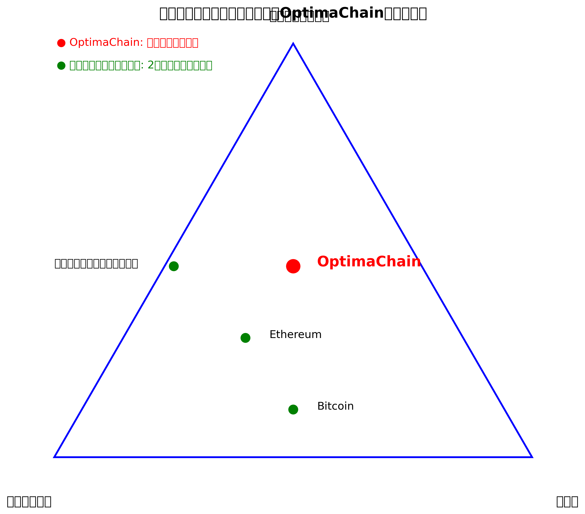

# 1. はじめに

ブロックチェーン技術は、分散型台帳技術（DLT）の革新として登場して以来、金融、サプライチェーン、ヘルスケアなど多くの産業に変革をもたらしてきました。しかし、既存のブロックチェーンプラットフォームは、スケーラビリティ、セキュリティ、分散化のトリレンマに直面しています。これらの課題を同時に解決することは、ブロックチェーン技術の大規模採用に向けた重要なステップです。

OptimaChainは、このトリレンマを解決するために設計された次世代ブロックチェーンプラットフォームです。AI駆動の適応型シャーディング技術と革新的なコンセンサスメカニズムを組み合わせることで、高スループット、低レイテンシー、強固なセキュリティを実現します。また、WASMベースのスマートコントラクト実行環境と多言語サポートにより、開発者にとって使いやすいプラットフォームを提供します。

本ホワイトペーパーでは、OptimaChainのアーキテクチャ、技術的特徴、およびエコシステムについて詳細に説明します。また、OptimaChainがブロックチェーン技術の未来にどのように貢献するかについても展望します。

## ブロックチェーントリレンマの解決

ブロックチェーントリレンマとは、スケーラビリティ、セキュリティ、分散化の3つの要素を同時に最適化することが困難であるという課題です。従来のブロックチェーンは、これらの要素のうち2つを最適化する代わりに、残りの1つを犠牲にする傾向がありました。

OptimaChainは、革新的な技術アプローチによってこのトリレンマを解決します：

1. **スケーラビリティ**: AI駆動の動的シャーディング技術により、ネットワークの負荷に応じて処理能力を自動的に調整します。これにより、理論上は無制限のスケーラビリティを実現します。

2. **セキュリティ**: Adaptive Proof-of-Stake (aPoS)コンセンサスメカニズムとAI駆動のセキュリティシステムにより、高度なセキュリティを確保します。さらに、量子耐性暗号を採用することで、将来的な脅威にも対応します。

3. **分散化**: 低いハードウェア要件と参加インセンティブにより、幅広いバリデータの参加を促進し、真の分散化を実現します。

## OptimaChainのビジョン

OptimaChainのビジョンは、ブロックチェーン技術を主流に押し上げ、個人、企業、および社会全体に価値をもたらすことです。具体的には、以下の目標を掲げています：

- **高性能なインフラストラクチャの提供**: 50,000 TPS以上のスループットと1秒未満のファイナリティを実現し、従来の中央集権的システムに匹敵するパフォーマンスを提供します。

- **開発者フレンドリーなエコシステムの構築**: 多言語サポートと包括的な開発ツールにより、開発者がイノベーションを創出しやすい環境を提供します。

- **相互運用性の促進**: クロスチェーン機能により、異なるブロックチェーンエコシステム間のシームレスな連携を可能にします。

- **持続可能なガバナンスの確立**: コミュニティ主導の透明なガバナンスモデルにより、長期的な持続可能性と進化を確保します。

次のセクションでは、OptimaChainの技術アーキテクチャについて詳細に説明します。