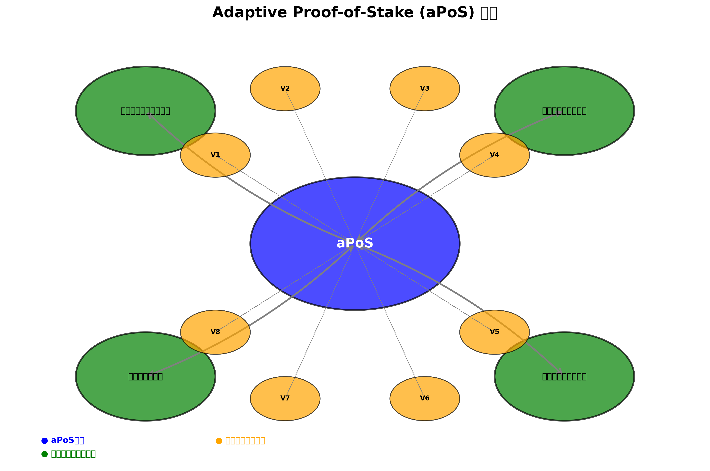

# 2.1 コンセンサスメカニズム: Adaptive Proof-of-Stake (aPoS)

OptimaChainは、Adaptive Proof-of-Stake（aPoS）と呼ばれる革新的なコンセンサスメカニズムを採用しています。aPoSは従来のPoSメカニズムを拡張し、ネットワークの状態に応じて動的にパラメータを調整する機能を追加しています。

## aPoSの概要



aPoSは、以下の主要な特徴を持つコンセンサスメカニズムです：

1. **多次元バリデータ評価**: ステーキング量だけでなく、過去のパフォーマンス、ネットワーク貢献度、信頼性スコアなど複数の要素に基づいてバリデータを評価します。

2. **動的パラメータ調整**: ネットワークの状態（負荷、セキュリティ脅威など）に応じてコンセンサスパラメータを自動的に調整します。

3. **即時ファイナリティ**: BFTスタイルのコンセンサスアルゴリズムにより、トランザクションの即時ファイナリティ（1秒未満）を実現します。

4. **エネルギー効率**: PoWと比較して非常に少ないエネルギー消費で動作し、環境に優しいブロックチェーンを実現します。

## バリデータ選出

aPoSでは、バリデータはステーキングされたOPTトークンの量だけでなく、過去のパフォーマンス、ネットワーク貢献度、および信頼性スコアに基づいて選出されます。この多次元評価システムにより、単に多くのトークンを保有しているだけでなく、ネットワークに積極的に貢献するバリデータが選出されます。

バリデータ選出の確率は以下の式で計算されます：

```
P(v) = S(v) × R(v) × C(v)
```

ここで：
- P(v)はバリデータvが選出される確率
- S(v)はバリデータvのステーキング量の正規化スコア
- R(v)はバリデータvの信頼性スコア（過去のパフォーマンスに基づく）
- C(v)はバリデータvのネットワーク貢献度スコア


## ブロック生成とファイナリティ

aPoSでは、選出されたバリデータがブロックを提案し、他のバリデータがそれを検証します。ブロックがファイナライズされるためには、バリデータの総ステーキング量の2/3以上の承認が必要です。

OptimaChainは、即時ファイナリティを実現するために、BFT（Byzantine Fault Tolerance）スタイルのコンセンサスアルゴリズムを採用しています。これにより、トランザクションは1秒以内にファイナライズされ、高速な取引確認が可能になります。

ブロック生成プロセスは以下のステップで行われます：

1. **バリデータ選出**: aPoSアルゴリズムに基づいて、次のブロック提案者が選出されます。
2. **ブロック提案**: 選出されたバリデータが新しいブロックを提案します。
3. **検証**: 他のバリデータがブロックの有効性を検証します。
4. **投票**: バリデータがブロックに対して投票します。
5. **ファイナリティ**: 2/3以上の承認を得たブロックがファイナライズされます。


## 適応型パラメータ調整

aPoSの革新的な特徴は、ネットワークの状態に応じてコンセンサスパラメータを動的に調整する能力です。例えば、ネットワークの負荷が高い場合、バリデータの数を増やしてスループットを向上させることができます。また、セキュリティ脅威が検出された場合、検証要件を厳格化してセキュリティを強化することができます。

この適応型パラメータ調整は、AIアルゴリズムによって制御されており、ネットワークのパフォーマンス、セキュリティ、および分散化のバランスを常に最適化します。

主な調整可能パラメータには以下が含まれます：

- **バリデータセットサイズ**: アクティブバリデータの数
- **ブロック生成時間**: ブロック間の目標時間間隔
- **検証要件**: ファイナリティに必要な承認の閾値
- **報酬分配**: バリデータへの報酬分配率


## aPoSのセキュリティ保証

aPoSは、以下のセキュリティ保証を提供します：

1. **Sybil攻撃耐性**: ステーキング要件により、Sybil攻撃（多数の偽のアイデンティティを作成する攻撃）を防止します。

2. **Nothing-at-Stake問題の解決**: スラッシング（不正行為に対する罰則）メカニズムにより、バリデータが複数のフォークに投票するインセンティブを排除します。

3. **長距離攻撃耐性**: 即時ファイナリティにより、長距離攻撃（過去のブロックから代替チェーンを構築する攻撃）を防止します。

4. **51%攻撃耐性の強化**: 多次元評価システムにより、単純なトークン保有量だけでなく、長期的な評判も重要になるため、51%攻撃のコストと難易度が大幅に増加します。

aPoSコンセンサスメカニズムは、OptimaChainの高性能、高セキュリティ、高エネルギー効率を実現する中核技術です。次のセクションでは、OptimaChainのダイナミックシャーディング技術について説明します。