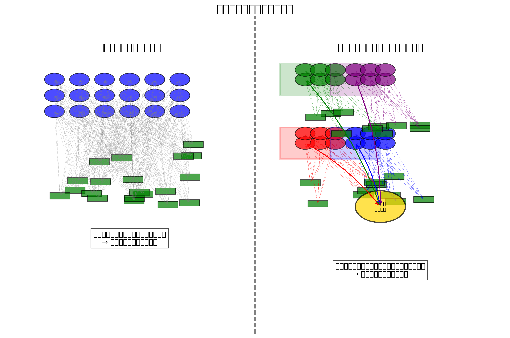

# 2.2 ダイナミックシャーディング

OptimaChainは、スケーラビリティを実現するために、ダイナミックシャーディング技術を採用しています。シャーディングとは、ブロックチェーンネットワークを複数の小さなパーティション（シャード）に分割し、各シャードが並行してトランザクションを処理する技術です。

## シャーディングの基本概念

従来のブロックチェーンでは、すべてのノードがすべてのトランザクションを処理する必要がありました。これはセキュリティと分散化には有利ですが、スケーラビリティの制約となります。シャーディングでは、ネットワークを複数のシャードに分割し、各シャードが独立してトランザクションのサブセットを処理します。これにより、ネットワーク全体のスループットが大幅に向上します。

OptimaChainのシャーディングは、以下の特徴を持ちます：

1. **水平スケーラビリティ**: シャードの数を増やすことで、ネットワークの処理能力を線形に拡張できます。
2. **動的シャード割り当て**: AIアルゴリズムを使用して、ネットワークの負荷に応じて最適なシャード構成を動的に決定します。
3. **クロスシャード通信**: 効率的なクロスシャード通信プロトコルにより、シャード間のデータ交換とトランザクション実行を可能にします。
4. **セキュリティ保証**: ランダムなバリデータ割り当てと頻繁な再シャッフリングにより、シャードの乗っ取りを防止します。

## シャード構造

OptimaChainのシャード構造は以下の3つのレイヤーで構成されています：

1. **ビーコンチェーン**：全体のコーディネーションを担当し、シャード間の通信を管理します。ビーコンチェーンは、バリデータの割り当て、シャード構成の変更、クロスシャードトランザクションの調整などを行います。

2. **シャードチェーン**：実際のトランザクション処理を行います。各シャードチェーンは独自のバリデータセットを持ち、独立してトランザクションを処理します。

3. **ステートチェーン**：システム全体の状態を管理します。ステートチェーンは、各シャードの状態ルートを集約し、グローバルな状態の整合性を確保します。

各シャードは独自のバリデータセットを持ち、独立してトランザクションを処理します。これにより、システム全体のスループットが大幅に向上します。

## 動的シャード割り当て

OptimaChainの革新的な特徴は、AIアルゴリズムを使用して動的にシャードを割り当てる能力です。このアルゴリズムは、トランザクションの種類、ネットワークの負荷、地理的分布などの要因を考慮して、最適なシャード構成を決定します。

動的シャード割り当てのプロセスは以下の通りです：

1. **データ収集**: ネットワークの負荷、トランザクションパターン、地理的分布などのデータを収集します。
2. **分析**: AIアルゴリズムがデータを分析し、最適なシャード構成を決定します。
3. **シャード割り当て**: バリデータを各シャードに割り当てます。
4. **モニタリング**: シャード構成のパフォーマンスを継続的にモニタリングします。
5. **再構成**: 必要に応じてシャード構成を再評価し、調整します。

例えば、特定のDAppのトラフィックが急増した場合、システムは自動的にそのDApp専用のシャードを作成し、リソースを効率的に割り当てることができます。また、地理的に近いノード間でシャードを形成することで、レイテンシーを最小化することも可能です。

## シャードの再構成

ネットワークの状態が変化すると、OptimaChainは自動的にシャード構成を再評価し、必要に応じて再構成します。この再構成プロセスは、ユーザーエクスペリエンスに影響を与えることなく、バックグラウンドで行われます。

シャードの再構成は、以下のステップで行われます：

1. **再構成の必要性をAIアルゴリズムが評価**: ネットワークの負荷、トランザクションパターン、シャードのパフォーマンスなどを分析し、再構成の必要性を判断します。
2. **新しいシャード構成の計画**: 最適な新しいシャード構成を計画します。
3. **バリデータの再割り当て**: バリデータを新しいシャードに再割り当てします。
4. **状態の移行**: 古いシャード構成から新しいシャード構成に状態を移行します。
5. **新しい構成でのオペレーション開始**: 新しいシャード構成での運用を開始します。

このプロセス全体は、ネットワークのセキュリティとパフォーマンスを維持しながら、シームレスに実行されます。

## シャーディングのセキュリティ

シャーディングの主な課題の一つは、個々のシャードのセキュリティを確保することです。OptimaChainは、以下のメカニズムを実装してシャードのセキュリティを確保しています：

1. **ランダムなバリデータ割り当て**: バリデータはランダムにシャードに割り当てられ、攻撃者がシャードを標的にすることを困難にします。
2. **頻繁な再シャッフリング**: バリデータの割り当ては定期的に再シャッフルされ、シャードの乗っ取りを防止します。
3. **クロスリンク検証**: シャードの状態はビーコンチェーンに定期的にクロスリンクされ、グローバルな検証を受けます。
4. **フィッシャーマン機能**: 不正行為を検出した任意のノードが、証拠を提出して報酬を得ることができます。

これらのメカニズムにより、OptimaChainはシャーディングの利点を活かしながら、高いセキュリティレベルを維持することができます。

次のセクションでは、OptimaChainのクロスシャードコミュニケーション技術について説明します。