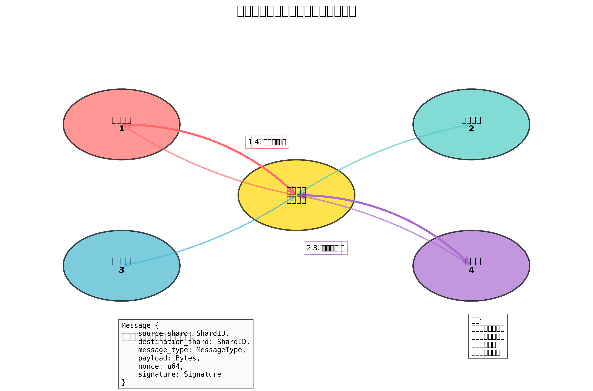

# 2.3 クロスシャードコミュニケーション

複数のシャードで構成されるシステムでは、シャード間の効率的な通信が不可欠です。OptimaChainは、低レイテンシーで安全なクロスシャードコミュニケーションを実現するために、革新的なプロトコルを採用しています。

## クロスシャード通信の概要



クロスシャード通信は、異なるシャード間でデータやメッセージを交換するためのメカニズムです。これにより、複数のシャードにまたがるトランザクションの実行や、シャード間の状態の同期が可能になります。

OptimaChainのクロスシャード通信は、以下の特徴を持ちます：

1. **低レイテンシー**: 最適化されたルーティングアルゴリズムにより、シャード間の通信を最小限のレイテンシーで実行します。
2. **高スループット**: 非同期メッセージパッシングにより、多数のクロスシャードトランザクションを効率的に処理します。
3. **原子性保証**: 2フェーズコミットプロトコルの拡張により、クロスシャードトランザクションの原子性を保証します。
4. **セキュリティ**: 暗号学的に検証可能なメッセージにより、シャード間通信のセキュリティを確保します。

## 非同期メッセージパッシング

OptimaChainは、シャード間の通信に非同期メッセージパッシングプロトコルを使用しています。このプロトコルにより、あるシャードから別のシャードにメッセージを送信し、トランザクションの実行を調整することができます。

メッセージは以下の形式で構造化されています：

```
Message {
    source_shard: ShardID,
    destination_shard: ShardID,
    message_type: MessageType,
    payload: Bytes,
    nonce: u64,
    signature: Signature
}
```

各フィールドの説明：
- `source_shard`: メッセージの送信元シャードのID
- `destination_shard`: メッセージの送信先シャードのID
- `message_type`: メッセージのタイプ（例：トランザクション、状態更新、クエリなど）
- `payload`: メッセージの本体（シリアライズされたデータ）
- `nonce`: リプレイ攻撃を防止するための一意の値
- `signature`: メッセージの整合性と認証を保証するための署名

非同期メッセージパッシングの処理フローは以下の通りです：

1. **メッセージ生成**: 送信元シャードがメッセージを生成し、署名します。
2. **メッセージルーティング**: ビーコンチェーンがメッセージを適切な宛先シャードにルーティングします。
3. **メッセージ検証**: 宛先シャードがメッセージの署名と内容を検証します。
4. **メッセージ処理**: 宛先シャードがメッセージを処理し、必要に応じて応答を生成します。
5. **応答ルーティング**: 応答が送信元シャードにルーティングされます（必要な場合）。

## アトミッククロスシャードトランザクション

複数のシャードにまたがるトランザクションの原子性を保証するために、OptimaChainは2フェーズコミットプロトコルを拡張した独自のプロトコルを実装しています。このプロトコルにより、クロスシャードトランザクションが全てのシャードで成功するか、全てのシャードで失敗するかのいずれかになることが保証されます。


アトミッククロスシャードトランザクションのプロセスは以下の通りです：

1. **準備フェーズ**:
   - トランザクションが全てのターゲットシャードに送信されます。
   - 各シャードはトランザクションを検証し、実行可能かどうかを判断します。
   - 各シャードは準備完了または中止のメッセージをコーディネーターに送信します。

2. **コミットフェーズ**:
   - 全てのシャードが準備完了を報告した場合、コーディネーターはコミットメッセージを送信します。
   - いずれかのシャードが中止を報告した場合、コーディネーターは中止メッセージを送信します。
   - 各シャードはコミットメッセージを受け取ると、トランザクションをコミットします。
   - 各シャードは中止メッセージを受け取ると、トランザクションをロールバックします。

3. **確認フェーズ**:
   - 各シャードはコミットまたは中止の確認をコーディネーターに送信します。
   - コーディネーターは全ての確認を受け取ると、トランザクションを完了とマークします。

このプロトコルは、ビザンチン障害耐性（BFT）を持つように拡張されており、一部のシャードが悪意を持って行動しても、システム全体の整合性が保たれます。

## シャードルーティング

効率的なクロスシャードコミュニケーションのために、OptimaChainは最適なルーティングパスを動的に決定するAI駆動のルーティングアルゴリズムを採用しています。このアルゴリズムは、ネットワークの混雑状況、レイテンシー、およびシャード間の依存関係を考慮して、最適な通信パスを選択します。


シャードルーティングの主な特徴は以下の通りです：

1. **動的ルート最適化**: ネットワークの状態に基づいて、最適なルーティングパスを動的に計算します。
2. **負荷分散**: 複数のルートにトラフィックを分散させ、特定のパスの過負荷を防止します。
3. **障害耐性**: ノードやリンクの障害を検出し、代替ルートを迅速に確立します。
4. **優先順位付け**: 重要なメッセージに高い優先順位を割り当て、処理を加速します。

AI駆動のルーティングアルゴリズムは、過去のパフォーマンスデータを学習し、将来のネットワーク状態を予測することで、ルーティング決定を継続的に改善します。

## クロスシャード通信の最適化

OptimaChainは、クロスシャード通信のパフォーマンスを最適化するために、以下の技術を採用しています：

1. **メッセージバッチング**: 複数のメッセージを単一のバッチにまとめることで、通信オーバーヘッドを削減します。
2. **メッセージ圧縮**: メッセージペイロードを圧縮して、帯域幅の使用を最小化します。
3. **キャッシング**: 頻繁にアクセスされるデータをキャッシュして、繰り返しのクロスシャードクエリを削減します。
4. **事前計算**: 予測可能なクロスシャード依存関係を事前に計算し、レイテンシーを削減します。

これらの最適化技術により、OptimaChainは高スループットと低レイテンシーのクロスシャード通信を実現し、シャーディングの利点を最大限に活用することができます。

次のセクションでは、OptimaChainのステートマネジメント技術について説明します。