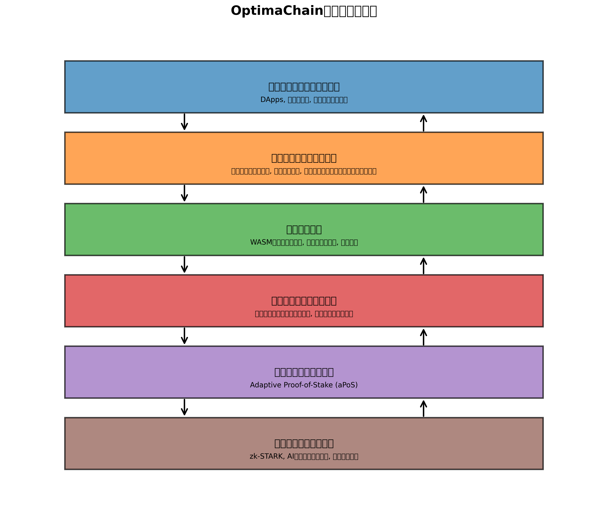

# 2. 技術アーキテクチャ

OptimaChainは、スケーラビリティ、セキュリティ、分散化を同時に実現するために、革新的な技術アーキテクチャを採用しています。このセクションでは、OptimaChainの主要な技術コンポーネントについて概要を説明します。

## OptimaChainアーキテクチャの概要

OptimaChainのアーキテクチャは、以下の主要コンポーネントで構成されています：

1. **コンセンサスレイヤー**: Adaptive Proof-of-Stake (aPoS)コンセンサスメカニズムを実装し、ネットワークの合意形成を担当します。

2. **シャーディングレイヤー**: ネットワークを複数のシャードに分割し、並行処理を可能にします。AI駆動のアルゴリズムにより、最適なシャード構成を動的に決定します。

3. **実行レイヤー**: WASMベースのスマートコントラクト実行環境を提供し、多様なプログラミング言語をサポートします。

4. **ステートレイヤー**: システム全体の状態を管理し、効率的なステート更新と検証を可能にします。

5. **クロスチェーンレイヤー**: 異なるブロックチェーンとの相互運用性を提供し、アセットとデータの転送を可能にします。

6. **セキュリティレイヤー**: zk-STARK技術、AI駆動セキュリティシステム、量子耐性暗号などの高度なセキュリティ機能を実装します。

これらのレイヤーが連携することで、OptimaChainは高性能で安全な分散型プラットフォームを実現しています。

## 主要技術コンポーネント

OptimaChainの主要な技術コンポーネントは以下の通りです：

### [2.1 コンセンサスメカニズム: Adaptive Proof-of-Stake (aPoS)](02_1_consensus_mechanism.md)

革新的なコンセンサスメカニズムであるAdaptive Proof-of-Stake (aPoS)は、ネットワークの状態に応じて動的にパラメータを調整し、最適なパフォーマンスとセキュリティを実現します。

### [2.2 ダイナミックシャーディング](02_2_dynamic_sharding.md)

AIアルゴリズムを使用して動的にシャードを割り当てるシャーディング技術により、ネットワークの負荷に応じてスケーラビリティを最適化します。

### [2.3 クロスシャードコミュニケーション](02_3_cross_shard_communication.md)

シャード間の効率的な通信を可能にする革新的なプロトコルにより、複数のシャードにまたがるトランザクションの原子性を保証します。

### [2.4 ステートマネジメント](02_4_state_management.md)

効率的なステート管理技術により、高速なトランザクション処理と効率的なストレージ利用を実現します。

次のセクションでは、これらの技術コンポーネントについて詳細に説明します。