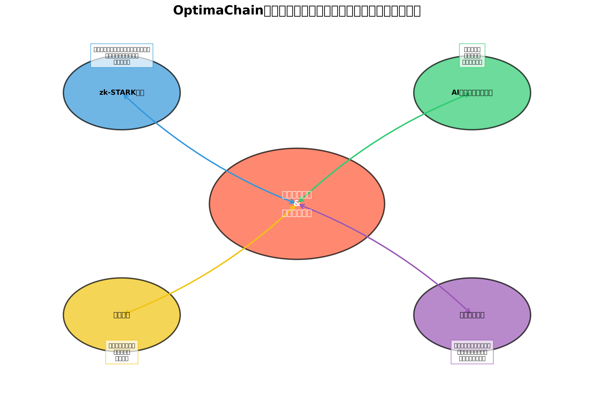

# 3. セキュリティとプライバシー

ブロックチェーンシステムにおいて、セキュリティとプライバシーは最も重要な側面です。OptimaChainは、最先端の暗号技術とAI駆動のセキュリティメカニズムを組み合わせて、強固なセキュリティとプライバシー保護を実現しています。

## セキュリティとプライバシーの概要

OptimaChainのセキュリティとプライバシーフレームワークは、以下の主要コンポーネントで構成されています：

1. **zk-STARK技術**: ゼロ知識証明を使用したプライバシー保護と効率的な検証
2. **AI駆動セキュリティシステム**: 継続的なモニタリングと脅威検出
3. **量子耐性暗号**: 将来の量子コンピュータの脅威に対する保護
4. **多層防御**: 複数のセキュリティレイヤーによる包括的な保護

これらのコンポーネントが連携することで、OptimaChainは高度なセキュリティとプライバシー保護を提供し、ユーザーとデータの安全を確保します。

## セキュリティの基本原則

OptimaChainのセキュリティアーキテクチャは、以下の基本原則に基づいています：

1. **最小権限の原則**: エンティティには、タスクの実行に必要な最小限の権限のみが付与されます。
2. **深層防御**: 複数の防御層を設けることで、単一の障害点を排除します。
3. **デフォルトでのセキュリティ**: システムはデフォルトで最も安全な構成で動作します。
4. **透明性**: セキュリティメカニズムは透明で検証可能です。
5. **継続的な改善**: セキュリティ対策は継続的に評価され、改善されます。

これらの原則に従うことで、OptimaChainは堅牢なセキュリティフレームワークを構築し、新たな脅威に対しても効果的に対応することができます。

## プライバシーの基本原則

OptimaChainのプライバシーフレームワークは、以下の基本原則に基づいています：

1. **プライバシー・バイ・デザイン**: プライバシー保護はシステム設計の初期段階から組み込まれています。
2. **データ最小化**: 必要最小限のデータのみが収集・保存されます。
3. **ユーザー制御**: ユーザーは自分のデータの共有方法を制御できます。
4. **目的の制限**: データは特定の目的のためにのみ使用されます。
5. **デフォルトでのプライバシー**: システムはデフォルトで最もプライバシーを保護する設定で動作します。

これらの原則により、OptimaChainはユーザーのプライバシーを尊重し、データの機密性を確保しながら、必要な機能を提供することができます。

## 主要セキュリティ機能

OptimaChainは、以下の主要セキュリティ機能を提供しています：

### [3.1 zk-STARK技術](03_1_zk_stark.md)

ゼロ知識証明技術の一つであるzk-STARKを採用し、プライバシー保護トランザクションとスケーラブルな検証を実現します。

### [3.2 AI駆動セキュリティシステム](03_2_ai_security.md)

AIアルゴリズムを使用してネットワークを継続的に監視し、異常を検出して自動的に対応します。

### [3.3 量子耐性暗号](03_3_quantum_resistance.md)

将来の量子コンピュータの脅威に対応するために、量子耐性のある暗号プリミティブを採用しています。

次のセクションでは、これらの主要セキュリティ機能について詳細に説明します。